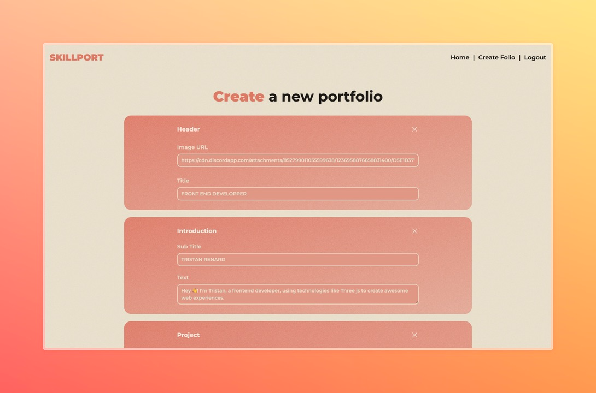

<div align="center">

# [SkillPort](https://github.com/parlabarbedeMerlin/skillport)

<p>
Create your own portfolio and share it with the world!
</p>


</div>

## 📝 Table of Contents
- [The concept](#the-concept)
- [About](#about)
- [Technologies](#technologies)
- [Installation Steps](#installation-steps)
- [Features](#features)
- [Screenshots](#screenshots)
- [License](#license)
- [Contributing](#contributing)

## The concept
SkillPort is fully based on one simple feature: **Create your blocks**. You can add the sections you want to create your own portfolio. You can add a title, a description, and a link to your project. You can create **YOUR** portfolio as **YOU** want.

## 🧐 About
This project was made by [Vincent](https://github.com/VGauthieer) , [Léa](https://github.com/leashmt) and [Tristan](https://github.com/TristanRenard/) in 3.5 days. This project is based on the [Next.js](https://nextjs.org/) framework and MongoDB for the DB. We have decided to do an editor to create portfolios. You can find the project after the 3.5 days of work in the branch `rendu`.

## 🚀 Technologies
- [Next.js](https://nextjs.org/)
- [MongoDB](https://www.mongodb.com/)
- [TailwindCSS](https://tailwindcss.com/)
- [React](https://reactjs.org/)

## 🛠️ Installation Steps
0. Prerequisites
- Node.js LTS
- npm or pnpm
- MongoDB

1. Clone the repository

```bash
git clone https://github.com/parlabarbedeMerlin/skillport
```

2. Change the working directory

```bash
cd skillport
```

3. Install dependencies

```bash
npm install

# or

pnpm install

```

4. Configure .env.local

```bash
cp .env.local.sample .env.local
```
Don't forget to provide a secret for the JWT_SECRET variable.

5. Run the app

```bash
npm run dev

# or

pnpm run dev
```

## 🌟 Features
- [x] Create your own portfolio
- [x] Share your portfolio 
- [x] Edit your portfolio
- [ ] Change the order of the blocks
- [ ] Upload images
- [ ] Add a custom domain
- [ ] Add a custom theme

## 📸 Screenshots
### Home Page


### Editor


### Generated Portfolio


## 📜 License
What you can do with this project :
- Copy, distribute and display the project
- Make derivative works or Modify the project

What you can't do with this project :
- Sublicense
- Private use
- Place warranty
- Hold liable

What you need to do if you want to modify or distribute the project :
- Include the original project
- Include the original license
- Send to us our version of the project
- Credit us

You can read the full license [here](./LICENSE)

## 🤝 Contributing

If you want to contribute to this project, you are welcome. You can fork the project and make a pull request with your changes. We will review it and merge it if it's good. You can also open an issue if you have a problem or a feature request. We will try to help you as soon as possible.
