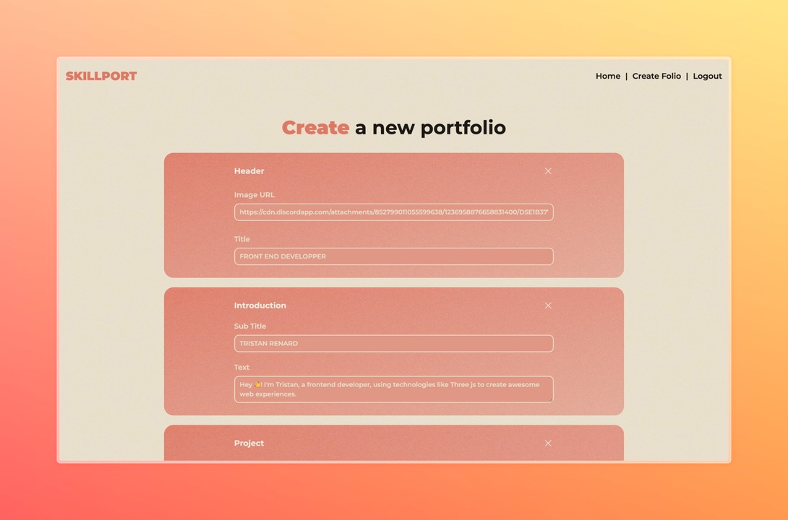

<div align="center">

# [SkillPort](https://github.com/parlabarbedeMerlin/skillport)

<p>
Create your own portfolio and share it with the world!
</p>


</div>

## 📝 Table of Contents
- [The concept](#the-concept)
- [About](#about)
- [Technologies](#technologies)
- [Installation Steps](#installation-steps)
- [Features](#features)
- [Screenshots](#screenshots)

## The concept
SkillPort is fully based on one simple feature: **Create your blocks**. You can add the sections you want to create your own portfolio. You can add a title, a description, and a link to your project. You can create **YOUR** portfolio as **YOU** want.

## 🧐 About
This project was made by [Vincent](https://github.com/VGauthieer) , [Léa](https://github.com/leashmt) and [Tristan](https://github.com/TristanRenard/) in 3.5 days. This project is based on the [Next.js](https://nextjs.org/) framework and MongoDB for the DB. We have decided to do an editor to create portfolios. You can find the project after the 3.5 days of work in the branch `rendu`.

## 🚀 Technologies
- [Next.js](https://nextjs.org/)
- [MongoDB](https://www.mongodb.com/)
- [TailwindCSS](https://tailwindcss.com/)
- [React](https://reactjs.org/)

## With Docker
1. Clone the repository

```bash
git clone https://github.com/parlabarbedeMerlin/skillport
```

2. Change the working directory

```bash
cd skillport
```

3. Create a .env file

```bash
cp .env.sample .env
```

4. Build and run the Docker containers

```bash
docker-compose up --build
```

TADA! The application should now be running at `http://127.0.0.1:3000`.

Pour plus d'informations [cliquez ici](/Docker.md).


## 🛠️ Installation Steps
0. Prerequisites
- Node.js LTS
- npm or pnpm
- MongoDB

1. Clone the repository

```bash
git clone https://github.com/parlabarbedeMerlin/skillport
```

2. Change the working directory

```bash
cd skillport
```

3. Install dependencies

```bash
npm install

# or

pnpm install

```

4. Configure .env.local

```bash
cp .env.local.sample .env.local
```
Don't forget to provide a secret for the JWT_SECRET variable.

5. Run the app

```bash
npm run dev

# or

pnpm run dev
```

## 🌟 Features
- [x] Create your own portfolio
- [x] Share your portfolio 
- [x] Edit your portfolio
- [x] Change the order of the blocks

## 📸 Screenshots
### Home Page


### Editor


### Generated Portfolio
